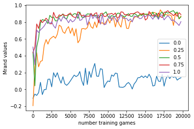

<!---<p align="center">
  
  
  
  
  
  
  
  
  
</p> -->
# Learning Tic-Tac-Toe with Tabular and Deep Q-learning algorithms - CS-456 Project


## Description
This goal of this project was to implements different intelligent agents to play the famous game of tic-tac-toe. To do so, we focused on two Reinforcement Learning techniques, notably Tabular Q-Learning and Deep Q-Learning (DQN) where the intelligent agent's behaviour is modeled by a fully connected neural network. 

Interestingly, the optimal policy for tic-tac-toe is known, so our aim is to answer these three questions:
1. Can RL algorithms learn to play tic-tac-toe by playing against optimal policy?
2. Can an RL algorithm learn to play tic-tac-toe only by playing against itself (self-learning)?
3. What are the pros and cons of Deep Q-Learning compared to (Tabular) Q-Learning?

This project was made as an assignment of the EPFL course [CS-456 Artificial Neural Networks](https://lcnwww.epfl.ch/gerstner/VideoLecturesANN-Gerstner.html) (2021/2022), given by Wulfram Gerstner and Johanni Brea.


## Authors
-  [Arina Lozhkina](https://github.com/arinaLozhkina)
- [Gianni Lodetti](https://github.com/Gianniii)

## Results
Through a lot of different game configurations (playing against good and bad experts, by self-learning, using decreasing exploration, modifying the batch size for Deep Q-Learning), our agents learned how to play the TicTacToe more or less well. With the appropriate *epsilon* and *n_star* though, some agents actually converged
towards the optimal policy. 

Among the two methods, Deep Q-Learning turned out to be preferable for learning, since it manages to achieve close to optimal performance, however it takes longer to train then simple Tabular Q-learning. 

The following images show results obtained with our Deep Q-Learning network. On the plot we see a performance metric of our algorithm(more details of this metric in the project description) against a random player. Each color line shows the performance of our algorithms after training against an optimal agent with epsilon greedy and different epsilon values. 



</p>
We can see that that our Deep Q-learning algorithm successfully learn to play tic-tac-toe and achieves near perfect scores against a random player after approximately 3500 games.

</p>

For a more detailed report of our results with the different learning algorithms, and to see all the experiments we did,  we encourage you to read the **final_report.pdf**, along with **Project_Description_TicTacToe.pdf** for the questions. 

## How to install and reproduce results
Download this repository as a zip file and extract it into a folder. The easiest way to run the code is to install Anaconda 3 distribution (available for Windows, macOS and Linux). To do so, follow the guidelines from the official
website (select python of version 3): https://www.anaconda.com/download/

Additional package required are: 
- pytorch
- tqdm
- plotly
- pandas

To install them write the following command on Anaconda Prompt (anaconda3):
```shell
cd *THE_FOLDER_PATH_WHERE_YOU_DOWNLOADED_AND_EXTRACTED_THIS_REPOSITORY*
```
Then write for each of the mentioned packages:
```shell
conda install *PACKAGE_NAME*
```
Some packages might require more complex installation procedures (especially [pytorch](https://pytorch.org/)). If the above command doesn't work for a package, just google "How to install *PACKAGE_NAME* on *YOUR_MACHINE'S_OS*" and follow those guides.

Then, you can run each of the cells in the jupyter notebooks  **tictactoe.ipynb** to test any game configuration you like. The notebooks follow the order of the questions in ```Project_Description_TicTacToe.pdf.pdf```.


## Files description
* **Project_Description_TicTacToe.pdf** : pdf containing the rules and questions to answer for the assignment of the EPFL course.
* **final_report.pdf** : pdf containing answers,plots and conclusions for course's assignment.
* **tictactoe.ipynb** : Jupyter Notebook containing a short tutorial on how to use the provided tictactoe environement aswell as all the code that we wrote and the results we achieved.
* **plots** : contains some of the plots that we saved throught our project
* **tic_env.py** : code implementation of the tictactoe game environment

## 🛠 Skills
Python, Pytorch, Matplotlib, Pandas. Machine learning, Reinforcement Learning, Q-Learning and Deep Q-Learning, self-learning, DQN.
